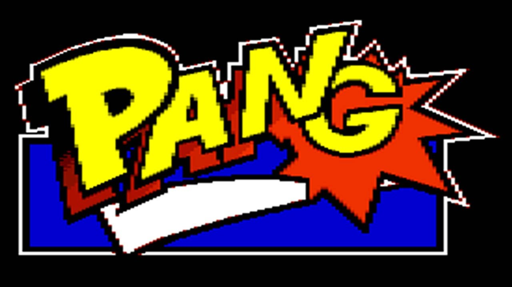
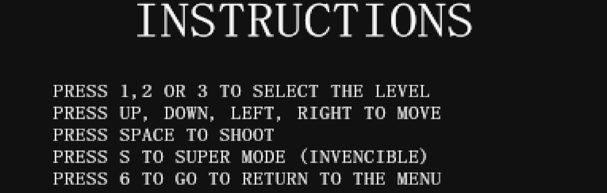

# 🏹 Pang Tribute
  
*A tribute of the classic arcade game Pang*

## 🎮 Introduction
Pang (also known as Super Pang outside Europe) is a legendary arcade game where players must destroy bouncing bubbles while avoiding contact with them. This tribute project aims to recreate the thrilling challenge and fun of the original game with a fresh design and modern enhancements.

## 🔥 Features & Gameplay
### ✅ Key Features
- **Classic-inspired graphics & sounds** 🎨🔊 *(Respecting copyright limitations.)*
- **3 levels** 🎯 *(Increasing difficulty with new obstacles.)*
- **Familiar mechanics** 🎮 *(Lateral movement, upward shooting, and splitting bubbles.)*
- **Points structure** 🎈 *(Using fruits and power ups system.)*

### 🕹️ Controls

  

| Action | Key |
|--------|-----|
| Select level | `1,2,3` |
| Move Left | `←` |
| Move Right | `→` |
| Move Up | `↑` |
| Move Down | `↓` |
| Shoot | `Space` |
| Invencible Mode | `S` |
| Return to Menu | `6` |

## 🛠️ Development & Technical Details
This game was developed with a passion for arcade classics and designed to retain the charm of the original Pang.


**To play:**  
1. Clone this repository:
   ```bash
   git clone https://github.com/henukk/pang.git
   cd pang/bin
   ```
2. Run the 02-Bubble.exe.
3. Enjoy the game!

## 👥 Credits
This project is a joint effort by passionate developers:
- **Héctor Núñez Carpio**  
  [GitHub](https://github.com/henukk)
- **Gisela Borrás Zaplana**  
  [GitHub](https://github.com/giselabz)

## 📖 Additional Resources
- **License:** [LICENSE.txt](./LICENSE.txt) 📜
- **Acknowledgements:** Special thanks to the VJ professors of *Facultad de Informática de Barcelona (UPC)* for inspiring this project, and to the original creators of Pang for their timeless game.

---
Get ready to pop some bubbles and relive the arcade magic! 🎈🎯

